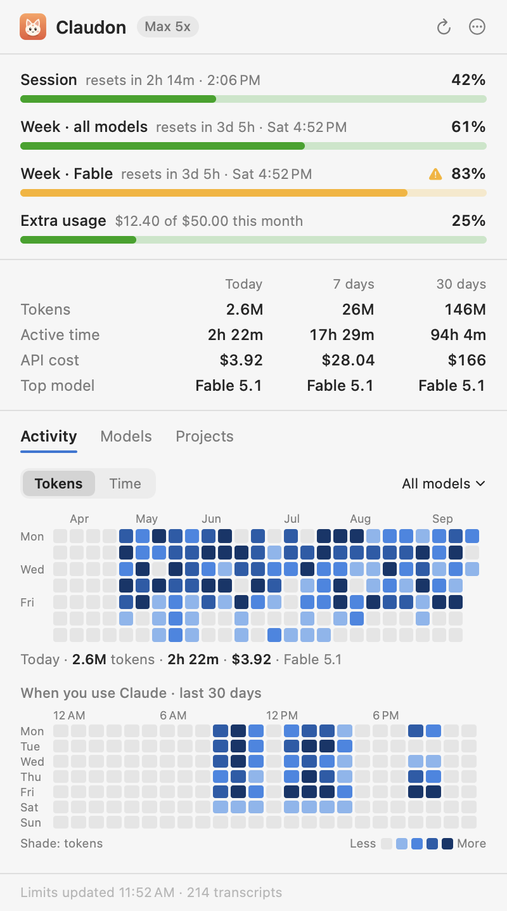
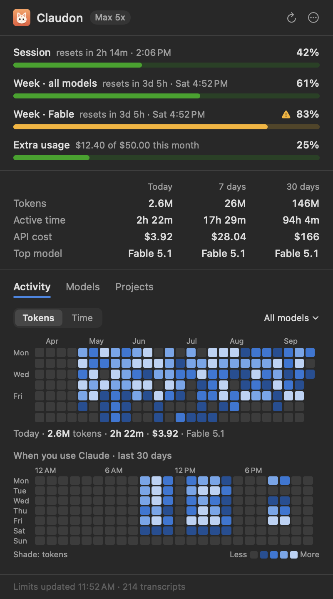
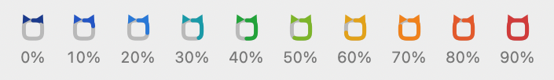

# Claudon

Claudon is a small macOS menu bar app that shows your Claude plan limits at a glance, plus where your Claude Code tokens go: which models, which projects, which days and which hours.

<picture>
  <source media="(prefers-color-scheme: dark)" srcset="docs/screenshots/menubar-dark.png">
  
</picture>

 

*Screenshots use made-up demo data (`make snapshots`).*

## What it shows

- **Menu bar:** the Claudon glyph, how much of the current 5-hour session you've used, and the time until it resets, for example `42% · 2h 14m`. The glyph fills clockwise and changes color every 10%, from dark blue through blue, green and orange to red, and the text turns orange at 80% and red at 95%.

  <picture>
    <source media="(prefers-color-scheme: dark)" srcset="docs/screenshots/stages-dark.png">
    
  </picture>

  Before usage loads, or when the latest check failed, the glyph shows as a plain outline so an old color isn't mistaken for current usage.

  If a weekly limit is used up, the menu bar shows that limit instead, since it's the one blocking you.
- **Limits:** the session, weekly limits (all models and per-model ones such as Fable) and extra usage spend. Each has a bar, a countdown and the clock time it resets.
- **Today, 7 days, 30 days:** tokens, active time, API-equivalent cost and the model you used most.
- **Activity:** a GitHub-style calendar of the last 26 weeks and a weekday-by-hour grid of the last 30 days. Switch between tokens and active time, filter to one model, and hover any square for its numbers.
- **Models and Projects:** tokens, share, time or replies, and API cost for the last 7 days, 30 days or all time.
- **Notifications:** when any limit passes 80% and 95% (once per window), and when a session that went past 80% resets.
- **Launch at login**, toggled from the ••• menu or by right-clicking the menu bar item.

## Where the numbers come from

**Plan limits** come from the Anthropic endpoint that Claude Code's `/usage` command uses (`api.anthropic.com/api/oauth/usage`). Claudon signs in with the Claude Code login already on your Mac: it reads the `Claude Code-credentials` keychain item through `/usr/bin/security`, or `~/.claude/.credentials.json` if that's where the login lives. Claudon only reads the login. It never refreshes it, changes it, or sends it anywhere except that endpoint. Limits are checked every 3 minutes, when you open the popover, and right after a window resets. If your login has expired, Claudon shows the last values it saw and asks you to run `claude` once.

**Tokens, models, projects and time** come from Claude Code's transcripts in `~/.claude/projects` (and `~/.config/claude/projects`). Claudon:

- reads only what was appended since the last pass, every 30 seconds;
- counts each reply once by its message and request ids, keeping the row with the final token counts, since Claude Code logs a streamed reply as several rows;
- bills each attempt of a server-side model fallback to the model that ran it;
- keeps its own totals in `~/Library/Application Support/Claudon/usage-index.json`, so your history stays after Claude Code deletes old transcripts (see its `cleanupPeriodDays` setting).

Limits cover all Claude use on your plan, including claude.ai and the desktop app. Token stats cover Claude Code on this Mac only, because that's what leaves local logs.

**Definitions**

- *Tokens:* input, output, cache writes and cache reads added together.
- *Active time:* each reply counts as 5 minutes of activity, and minutes from parallel sessions count once. It measures the time Claude was working with you.
- *API cost:* what the same tokens would cost at Anthropic's API list prices, including the per-model cache prices. Prices live in `Sources/ClaudonCore/ModelCatalog.swift` (last checked 2026-09-23). Your subscription is billed differently, so treat this as a sense of scale.

## Install

You need macOS 14 or later and the Swift 6 toolchain, which comes with either Xcode or the Command Line Tools (`xcode-select --install`).

```sh
make install
```

This builds `build/Claudon.app`, copies it to `/Applications` (or `~/Applications`) and starts it. The first time it runs from there, Claudon turns on launch at login and asks for permission to send notifications.

## Develop

```sh
make build       # debug build
make test        # unit tests (Swift Testing)
make app         # release bundle in build/Claudon.app
make snapshots   # render the popover with demo data into docs/screenshots
```

`Claudon --snapshot <folder>` renders the popover with your real data instead, reading the transcripts into a throwaway state file.

| Folder | Contents |
| --- | --- |
| `Sources/ClaudonCore` | Transcript index, limits client and parser, pricing, aggregation and formatting. No UI, covered by the tests. |
| `Sources/Claudon` | The app: the AppKit status item, the SwiftUI popover, notifications, the login item and the menu bar glyph and app icon, both drawn in code. |
| `Tests/ClaudonCoreTests` | Tests for de-duplication, incremental reads, time zones, limits parsing, alerts and formatting. |
| `scripts` | Build, install and uninstall scripts. |

## Uninstall

```sh
make uninstall
```

This quits Claudon and removes the app, its settings and its usage history.
